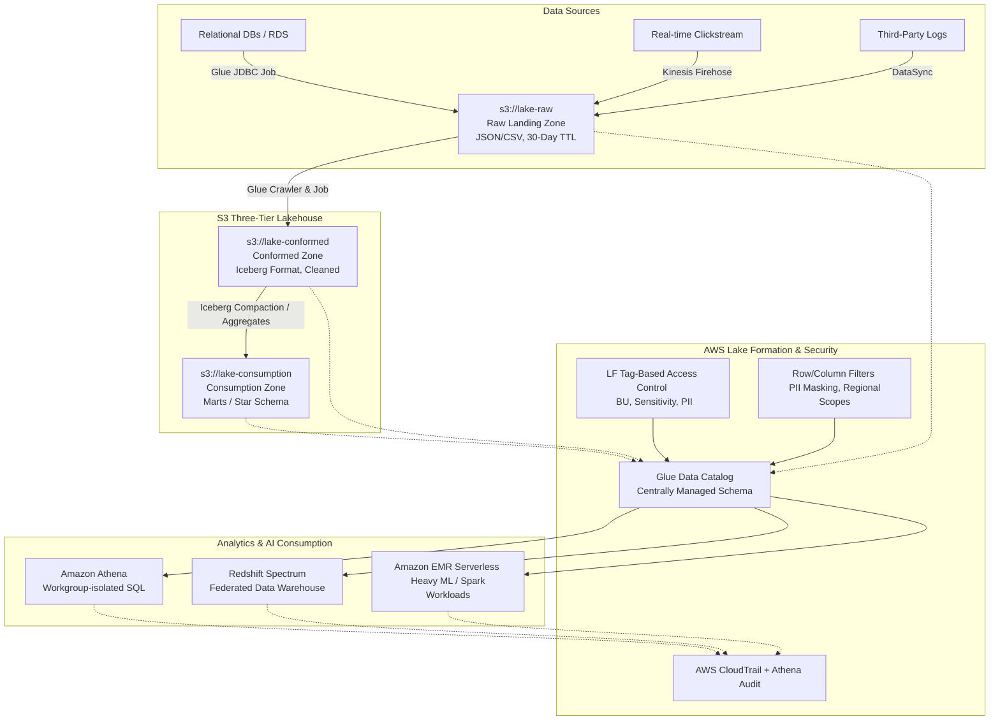

# Governed multi-tenant Cloud Data Lakehouse on AWS with Apache Iceberg & Lake Formation

[](https://github.com/PSURI1894/Cloud-Data-Lake-on-AWS-with-Lake-Formation-Governance/actions/workflows/terraform.yml)
[](https://github.com/PSURI1894/Cloud-Data-Lake-on-AWS-with-Lake-Formation-Governance/actions/workflows/python-tests.yml)
[](https://github.com/PSURI1894/Cloud-Data-Lake-on-AWS-with-Lake-Formation-Governance/actions/workflows/governance-drift.yml)
[](https://opensource.org/licenses/MIT)

An enterprise-grade, production-ready, three-tier data lakehouse deployed on AWS. The platform supports multi-tenant analytics across 30+ data sources and enforces cell-level security (column-masking, row-filtering) using **AWS Lake Formation Tag-Based Access Control (LF-TBAC)**. Raw streaming and batch transactions land on Amazon S3 and are transformed into highly performant, schema-evolving, transactional **Apache Iceberg** datasets through **AWS Glue Spark** pipelines.

---

## 🌟 Key Highlights & System Capabilities
*   **Three-Tier Storage Topology**: Logically isolated `Raw` (S3 Glacier Transition), `Conformed` (S3 Intelligent-Tiering with Apache Iceberg format), and `Consumption` (BU-specific aggregate marts).
*   **Granular Governance (LF-TBAC)**: Fine-grained access policies dynamically derived from Tag hierarchies (`BU`, `Sensitivity`, `PII`) rather than rigid IAM bindings.
*   **Privacy & Compliance Engineering**: Column-level nullification/hashing of sensitive indicators (SSN, phone) and row-level localization (restricting analysts to regional scopes).
*   **Advanced Iceberg Operations**: High-performance deduplication (`MERGE INTO`), hidden partitioning (`days(transaction_time)`), nightly compaction, and metadata snapshot pruning.
*   **Automated Security Actions**:
    *   **Lambda PII Auto-Detector**: Listens to Glue Crawler completions, samples data from S3, executes heuristic evaluations, and applies corresponding PII tags in Lake Formation.
    *   **Lambda Tag Reconciler**: Compares active Glue Catalog table tags against [tag_policy.yaml](file:///c:/Users/parth/Data%20Engineering/Cloud%20Data%20Lake%20on%20AWS%20with%20Lake%20Formation%20Governance/src/governance/tag_policy.yaml), reporting/healing drifts.
*   **Operational Cost Controls**: Athena workgroups configured with query volume scanning thresholds (10GB sandboxes) and a custom CloudTrail SQL linter targeting costly `SELECT *` patterns.

---

## 🏗️ System Architecture In-Depth



---

## 📂 Repository Blueprint

```
├── .github/
│   └── workflows/
│       ├── terraform.yml           # Terraform validation, linting, and planning
│       ├── python-tests.yml        # PySpark unit tests & coverage reports
│       └── governance-drift.yml    # Linting & validating Lake Formation tag schema compliance
├── terraform/
│   ├── main.tf                    # Provider configuration & main S3 infrastructure
│   ├── variables.tf               # Centralized parameters (environments, BU tags)
│   ├── outputs.tf                 # Useful output endpoints & role ARNs
│   ├── s3.tf                      # S3 Raw, Conformed, Consumption, Utility buckets & replication
│   ├── glue.tf                    # Glue Catalog DBs, Iceberg configurations, Crawlers, PySpark Jobs
│   ├── lakeformation.tf           # LF Tags, TBAC settings, Data Filters, Column/Row Masking policies
│   ├── athena.tf                  # Athena workgroups, Federated connectors, Saved Audit queries
│   ├── iam.tf                     # IAM Roles for Glue, Athena, EMR Serverless, Lambdas
│   ├── monitoring.tf              # CloudTrail configuration, S3 Storage Lens, CloudWatch dashboards
│   └── terraform.tfvars           # Default production-grade variable mappings
├── src/
│   ├── glue_jobs/
│   │   ├── raw_to_conformed_pyspark.py   # Elite Iceberg PySpark job (Upserts, Schema Evolution)
│   │   ├── conformed_to_consumption.py   # PySpark aggregate builder & SCD Type 2 implementation
│   │   └── iceberg_maintenance.py        # Compaction, snapshot pruning, orphan file cleanup
│   ├── lambdas/
│   │   ├── lf_tag_reconciler/
│   │   │   └── index.py           # Auto-reconciles catalog tags & reports drifts
│   │   └── pii_auto_detector/
│   │       └── index.py           # Compares crawler outputs, runs Macie, auto-tags catalog
│   └── governance/
│       ├── athena_linter.py       # Best practice SQL linter scanning CloudTrail logs for costly queries
│       └── tag_policy.yaml        # Hierarchical LF-tag definition matrix
├── local_dev/
│   ├── docker-compose.yml         # LocalStack, MinIO, Jupyter, and mock environments
│   ├── mock_data_generator.py     # High-fidelity mock stream/batch data generator with PII
│   └── run_local_spark.py         # PySpark execution script running local Iceberg tables
├── tests/
│   ├── conftest.py                # Local Spark Session initialization with Iceberg catalog
│   ├── test_raw_to_conformed.py   # Test suite for conformed ingestion layer
│   └── test_pii_auto_detector.py  # Test suite for auto-tagging Lambda
├── README.md                      # Extensive enterprise documentation
└── pyproject.toml                 # Poetry dependencies configuration (pyspark, pytest, boto3, etc.)
```

---

## 🛠️ Technology & Version Matrix

| Resource / Tool | Deployed Version / Spec | Functional Role in Architecture |
| :--- | :--- | :--- |
| **Amazon S3** | Standard, Intelligent-Tiering, Glacier | Centralized storage across raw, conformed, consumption tiers |
| **Apache Iceberg** | Version 1.3.1 (v3 spec engine) | Structured, ACID transactional table management |
| **AWS Glue** | Engine Version 4.0 (Spark 3.4.1, Scala 2.12) | Serverless data transform (PySpark pipelines) |
| **AWS Lake Formation**| Tag-based Access Control (LF-TBAC) | Central governance, row filters, column-level masking |
| **Amazon Athena** | Engine Version 3 (Presto-based) | Serverless interactive SQL queries with Iceberg support |
| **Terraform** | CLI version >= 1.5.0 | Complete declarative Infrastructure as Code (IaC) |
| **LocalStack** | Latest (Enterprise emulation) | Off-cloud emulation of AWS APIs (S3, Glue, KMS, IAM) |
| **MinIO** | Latest stable | Local S3-compatible high-performance object storage |

---

## ⚙️ Ingestion & Transformation Pipelines

### 1. Ingestion Layer (`raw_to_conformed_pyspark.py`)
This PySpark pipeline processes files arriving in the S3 Raw Landing Zone (CSV transaction streams and JSON customer dumps). It:
1. Normalizes columns to lower snake case, validates schema shapes, and enforces datatypes.
2. Anonymizes primary PII indicators immediately at ingestion using a SHA-256 hash.
3. Implements **Apache Iceberg Hidden Partitioning** using:
   ```sql
   PARTITIONED BY (days(transaction_time), region_code)
   ```
4. Executes an ACID-safe deduplicating upsert (`MERGE INTO`):
   ```sql
   MERGE INTO awsglue.conformed_db.transactions t
   USING incoming_transactions s
   ON t.transaction_id = s.transaction_id
   WHEN MATCHED THEN
       UPDATE SET t.amount = s.amount, t.product_id = s.product_id, t.ingested_at = s.ingested_at
   WHEN NOT MATCHED THEN
       INSERT (transaction_id, customer_id, amount, region_code, transaction_time, ...)
       VALUES (s.transaction_id, s.customer_id, s.amount, s.region_code, s.transaction_time, ...)
   ```

### 2. Analytical Layer (`conformed_to_consumption.py`)
Aggregates transactional and profile history to structure a dimensional Star Schema (`dim_customers`, `fact_transactions`). 
It handles **SCD Type 2 (Slowly Changing Dimensions)** for customer properties to maintain a history of profile modifications:
```sql
-- Expires the current active row where modifications are detected
MERGE INTO awsglue.consumption_db.dim_customers d
USING updates u
ON d.customer_id = u.customer_id AND d.is_current = true
WHEN MATCHED THEN
    UPDATE SET d.is_current = false, d.end_date = current_timestamp();

-- Inserts a fresh record with is_current = true
INSERT INTO awsglue.consumption_db.dim_customers
SELECT uuid() as customer_key, customer_id, first_name, email, region_code,
       current_timestamp() as start_date, cast(null as timestamp) as end_date, true as is_current...
```

### 3. Maintenance Layer (`iceberg_maintenance.py`)
To prevent the "small file problem" and minimize Athena planning overhead, this Spark job performs nightly optimizations:
```sql
-- 1. Compact small data files into targeted sizes (~512MB)
CALL awsglue.system.rewrite_data_files(table => 'awsglue.conformed_db.transactions');

-- 2. Expire old Iceberg historical snapshots (keep 7 days of history)
CALL awsglue.system.expire_snapshots(table => 'awsglue.conformed_db.transactions', older_than => TIMESTAMP '2026-05-18 00:00:00', retain_last => 3);

-- 3. Cleanup orphan files on S3 no longer registered in metadata
CALL awsglue.system.remove_orphan_files(table => 'awsglue.conformed_db.transactions');

-- 4. Rewrite manifest indexes to optimize partition pruning speeds
CALL awsglue.system.rewrite_manifests(table => 'awsglue.conformed_db.transactions');
```

---

## 🔒 Security & Governance Blueprint

Rather than mapping individual table policies across hundreds of entities, our platform uses **Lake Formation Tag-Based Access Control (LF-TBAC)**.

### 1. Granular Policy Matrix
We define three core metadata tag keys registered via Terraform:
*   `BU` (Business Unit): `[marketing, finance, compliance, analytics, operations]`
*   `Sensitivity`: `[public, internal, confidential, restricted]`
*   `PII`: `[none, quasi, direct]`

### 2. Multi-Tenant Persona Roles
The platform provisions access restrictions for different roles:
1.  **Finance Analyst (`finance-analyst-data-lake-role`)**:
    *   *Permissions*: Can read tables tagged `BU=finance` AND `Sensitivity=public, internal`.
    *   *Governance Block*: Prevented from reading high-confidentiality tables.
2.  **APAC Analyst (`apac-analyst-data-lake-role`)**:
    *   *Permissions*: Accesses conformed transaction tables through a **Row-Level Data Filter**:
        ```sql
        WHERE region_code = 'APAC'
        ```
    *   *Governance Block*: Cannot view records originating from `US`, `EU`, or `LATAM`.
3.  **Marketing Analyst (`marketing-analyst-data-lake-role`)**:
    *   *Permissions*: Accesses customer data via a **Column-Level Exclusion Mask**:
        ```sql
        EXCLUDE COLUMN ssn, phone_number
        ```
    *   *Governance Block*: Prohibits viewing highly sensitive indicators like Social Security Numbers and customer phone numbers, while maintaining access to hashed values.

---

## 🚀 Step-by-Step Local Setup & Execution

You can run, test, and query this entire architecture locally on your computer without incurring AWS costs using our Docker configuration and PyTest suites.

### 1. Spin up Local Infrastructure
Boot the LocalStack, MinIO S3 API, and PySpark-Iceberg container:
```bash
cd local_dev
docker compose up -d
```

### 2. Initialize Poetry Dependencies
Ensure Poetry is installed, then build the Python environment:
```bash
poetry install
```

### 3. Generate Mock Data
Generate mock customers (JSON) and transactional partitions (CSV) containing schema-drifts and dummy SSNs:
```bash
poetry run python mock_data_generator.py
```

### 4. Execute Unit Test Suites
Execute localized Spark-Iceberg unit tests:
```bash
poetry run pytest ../tests/ -v
```

### 5. Run Local Spark Jobs
Submit PySpark jobs locally using our Spark wrapper:
```bash
# Run Raw-to-Conformed Iceberg Upsert Job
poetry run python run_local_spark.py raw_to_conformed_pyspark

# Run Conformed-to-Consumption SCD-2 Star Schema Builder
poetry run python run_local_spark.py conformed_to_consumption

# Run Iceberg Compaction Maintenance Job
poetry run python run_local_spark.py iceberg_maintenance
```

### 6. Lint SQL Queries Against Cost Constraints
Test if queries run by analysts comply with partition pruning rules:
```bash
poetry run python ../src/governance/athena_linter.py
```

---

## 📈 Git Branch & Evolution Tracing

The platform was built following strict Git flow principles. You can inspect the historical development of the system across **10 distinct branches**:

1.  `main` - Production-stable release branch containing the fully integrated lakehouse.
2.  `infra/terraform-base` - Baseline S3 buckets, SSE-KMS configurations, access policies, IAM roles, and Athena workgroups.
3.  `infra/lakeformation-tbac` - Centralized Lake Formation tags, tag-based access control policies, and data filters.
4.  `feature/glue-pipelines` - PySpark Glue templates for Raw-to-Conformed Iceberg writes, type casting, and schema-drift processing.
5.  `feature/iceberg-optimization` - Automated Spark SQL maintenance scripts (Compaction, snapshot pruning, and orphan file removal).
6.  `feature/consumption-marts` - Dimensional conformed-to-consumption jobs, SCD-2 transforms, and analytical marts.
7.  `governance/auto-tagging` - Lambda-based PII auto-detector, regex data profiling, and catalog tag reconcilers.
8.  `security/audit-monitoring` - CloudTrail Athena queries, cost dashboards, and the custom query linter.
9.  `test/localstack-setup` - Local developer docker-compose, mock data generator, and local Spark runtime.
10. `cicd/github-workflows` - GitHub Actions configurations for Terraform checks, Spark unit testing, and tag compliance.

---

## 🏆 Performance & Scaling Optimization Guide
*   **Preventing S3 Prefix Throttling**: Iceberg tables write files with randomized sub-prefix hashes (rather than synchronous sequential strings), bypassing the standard S3 limit of 3,500 PUTs / 5,500 GETs per second.
*   ** hidden Partitioning**: Partitioning is calculated dynamically at runtime (e.g., `days(transaction_time)`) without requiring queries to explicitly filter on generated partition columns.
*   **Workgroup Guardrails**: Sandbox Athena workgroups reject queries scanning more than 10GB of data, protecting against costly `SELECT *` queries on multi-terabyte datasets.
*   **Manifest Files Rewriting**: Running manifest file maintenance consolidates metadata directories, optimizing the partition pruning phase during query planning.

---

## 👨‍💻 Author & Contributions
*   **Architect/Author**: Parth
*   **GitHub**: [@PSURI1894](https://github.com/PSURI1894)
*   **Email**: [parthsuri009@gmail.com](mailto:parthsuri009@gmail.com)
*   **Prepared For**: Self-directed production data engineering preparation.
